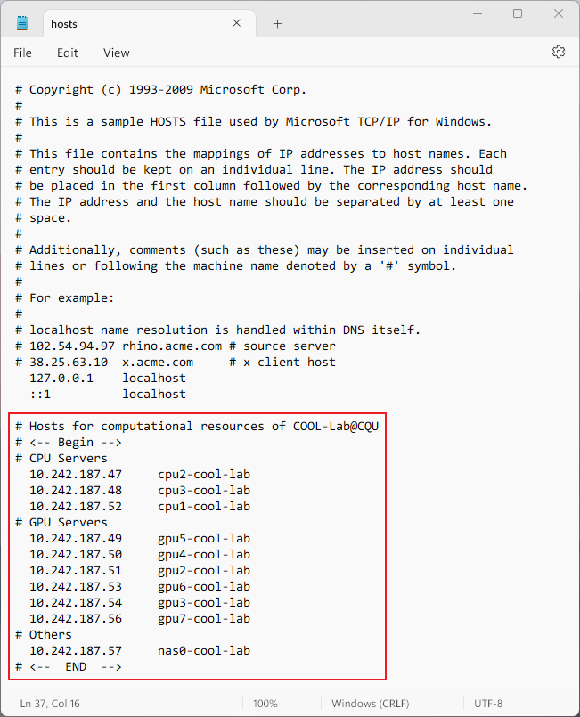

# Usage of Coputational Resources within COOL-Lab

## Hosts File Configuration

### Windows (for Win7 and newer)

1. Download the `hosts` file in the repository.
2. Search for `cmd` in Windows, right click and then select `Run as administrator`.

    

    | The above UI may be different for different Windows versions.

3. Run the following command,

    ```cmd
    notepad C:\Windows\System32\drivers\etc\hosts
    ```

    and then a notepad will open.

4. Copy all the contents in the file you downloaded, and paste them into the end of the system hosts file (opened in the previous step).

    

5. Save the file and close it. All done.

After configuring the hosts file, you can access the server by alias so that avoid memorizing the IP address. For example, to ssh into cpu3, just run

```cmd
ssh cpu3-cool-lab
```

In other words, just replace the IP address in your previous usage with the corresponding string alias.

### MacOS / Linux

As a MacOS/Linux user, I'm assuming you're a professional computer user. You can understand the meaning of the hosts file and add the entries we have provided on your own.

Of course, we will also give a sample command for those who are not familiar with UNIX-like systems. **Please note that the following commands use administrator privileges, so be sure to check the directories and commands carefully before running them.**

```bash
cd <the directory you place the downloaded hosts file>
# For MacOS, use zsh as the default shell
sudo zsh -c 'cat hosts >>/etc/hosts'
# For Linux, usually use bash by default
sudo bash -c 'cat hosts >>/etc/hosts'
```

## Create your personal container and access

TODO
